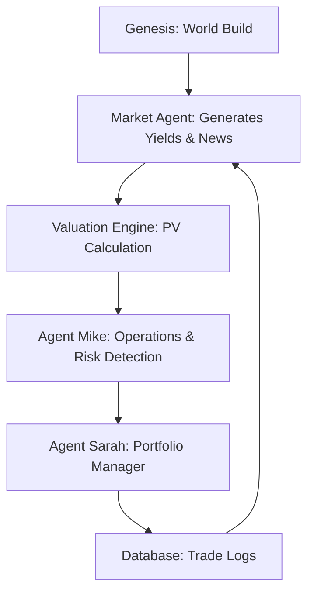

Created by Faraz Fookeer: farazfookeer.com

Here is the professional `README.md` body text. You can copy and paste this directly into your GitHub repository.

I have structured it to highlight the **enterprise value** of the system, positioning you as an expert in AI Agents and Financial Engineering.

---

# Simulated AI-Powered Liabilities Driven Investment Management Company 
(An AI-driven financial risk engine)

## 📉 Overview

This project is an autonomous **AI-driven financial risk engine** designed to simulate liquidity crises (specifically Liability-Driven Investment strategies) and test the resilience of automated portfolio management agents.

Unlike static backtesting, this system uses **Generative AI agents** to:

1. **Invent** dynamic market scenarios (news, yield spikes, regime changes).
2. **Detect** insolvency risks in real-time (Margin Call Ops Agent).
3. **Execute** strategic trades to preserve solvency (Portfolio Manager Agent).

**Use Case:** Originally built to simulate the UK Pension LDI crisis, this architecture is fully adaptable for **DeFi Protocol Stress Testing** (e.g., simulating "Death Spirals" in stablecoin collateral).

---

## 🏗 Architecture

The system operates on a cyclic "Game Loop" managed by n8n workflows.

### The Workflows

* **Workflow A (Genesis):** Generates `clients`, `liabilities`, and `collateral_inventory` in PostgreSQL.
* **Workflow B (Market):** AI generates daily economic news and moves the 10y Gilt Yield curve.
* **Workflow C (Valuation):** Calculates net present value (PV) of liabilities vs. assets.
* **Workflow D (Ops Agent "Mike"):** Monitors funding levels. If Funding < 100%, issues formal SQL-backed Margin Calls.
* **Workflow E (Trader Agent "Sarah"):** Analyzes liquidity. autonomously decides between **SELLING** assets (de-risking) or **REPO** (hedging) based on funding depth.
* **Workflow F (Autopilot):** The "Game Loop" that triggers the simulation to run for 30+ sequential days.

---

## 🤖 The AI Agents

### 1. Agent "Mike" (Operations & Risk)

* **Role:** The "Bad Cop."
* **Logic:** Monitors the `liabilities_daily` table.
* **Action:** Detects breaches and inserts rows into `margin_calls`. Drafting "Angry Emails" to the portfolio manager describing the shortfall.

### 2. Agent "Sarah" (Portfolio Manager)

* **Role:** The "Strategist."
* **Logic:** Reads the incoming Margin Call and checks `collateral_inventory`.
* **Decision Matrix:**
* *High Solvency (>120%):* Executes **REPO** (Lend Gilts for Cash) to maintain duration hedge.
* *Critical Solvency (<80%):* Executes **SELL** (Liquidate Gilts) to survive immediate cash crunch.
* *Excess Cash:* Executes **REVERSE_REPO** to capture yield.

* **Tech:** Uses a custom "Metal Detector" parser to extract valid JSON trade instructions from natural language reasoning.

---

## 📊 Dashboard & Analytics

The system includes a self-hosted live dashboard (Workflow G) visualizing:

* Real-time Gilt Yields vs. Average Fund Solvency.
* Daily logs of Agent Sarah's trade rationales.
* Total insolvency events avoided.

---

## 🛠 Tech Stack

* **Orchestration:** [n8n](https://n8n.io/) (Self-hosted)
* **Database:** PostgreSQL (Supabase)
* **LLM:** OpenAI GPT-4o (Decision Logic)
* **Visualization:** QuickChart.io + HTML/CSS injection

---

## 🚀 Setup & Installation

### 1. Database Setup

Execute the contents of `schema.sql` in your PostgreSQL instance to create the necessary tables (`clients`, `trades`, `margin_calls`, etc.).

### 2. Import Workflows

Import the JSON workflow files into your n8n instance:

* `Workflow_A_Genesis.json`
* `Workflow_F_Autopilot.json`
* (Import all others A-G)

### 3. Environment Variables

Configure your n8n credentials:

* `SUPABASE_URL` & `SUPABASE_KEY`
* `OPENAI_API_KEY`

### 4. Run Simulation

1. Run **Workflow Z** to wipe/reset the database.
2. Run **Workflow A** to initialize the funds.
3. Activate **Workflow F** to start the 30-day autopilot loop.

---

## 🔮 Future Roadmap (DeFi Pivot)

* **Adaptation:** Swap "Gilts" for "stETH" and "Pension Liabilities" for "Perpetual Funding Rates".
* **Goal:** Offer "Insolvency Oracle" services to new DeFi protocols to crash-test their liquidation logic before mainnet launch.

---

## 📄 License

MIT License. Free to use for educational and simulation purposes.
